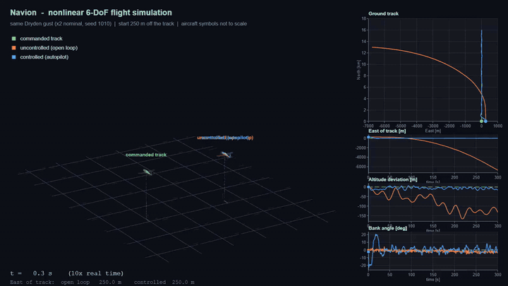

# Navion Flight Control: Linear Design, Nonlinear 6-DoF Validation

Autopilot design and robustness study for the Navion light aircraft, built in MATLAB and Simulink. Controllers are designed on linear models, then validated on a nonlinear 12-state rigid-body model under Dryden turbulence, realistic actuators and sensor lags, parameter uncertainty and large-amplitude maneuvers.



*Same Dryden gust, same start 250 m off the track: green is the commanded track, orange the open-loop aircraft, blue the aircraft with the autopilot ([full-quality video](results/media/nl_flight.mp4)).*

## Highlights

- **Gust rejection:** under Dryden turbulence the altitude/speed hold cuts the rms altitude deviation from about 54 m to 3.7 m, and the track hold brings the rms cross-track error from over 700 m (open loop, nonlinear) to 6.2 m.
- **Linear design carries over to the nonlinear plant:** with the full controller, rms altitude, pitch, bank and cross-track agree within about 2-6 % between the linear and the nonlinear model (10 gust seeds).
- **Realistic hardware barely matters:** second-order servos (15 rad/s, 25° and 30°/s limits), thrust lag and sensor lag raise the rms altitude deviation by about 4 %; 10 of 10 runs stay bounded.
- **Level 1 flying qualities** (MIL-F-8785C, Class I, Category B) for short period, phugoid, Dutch roll, roll mode and spiral.
- **Robust over parameter uncertainty:** 2000-sample Monte Carlo per uncertainty level; 100 % of closed loops are stable at ±20 % derivative / ±10 % mass uncertainty, and still 97.7-99.5 % at three times that.
- **Large maneuvers recover:** 13 of 13 off-trim starts (bank up to 60°, pitch ±10°, 20-60° heading error, 1000 m cross-track offset) return to the track.

## What is in the project

**Aircraft.** Navion, sea-level cruise at 53.64 m/s (Nelson, *Flight Stability and Automatic Control*). Stability derivatives and mass properties are in `src/params/navion_params.m`.

**Models**

| Model | Description |
|---|---|
| Linear | Longitudinal `[V γ α q (θ)]` and lateral `[r β p φ]` state-space models, with gust input through the angle-of-attack and sideslip columns |
| Nonlinear | 12-state rigid body `[u v w p q r φ θ ψ N E h]`, flat non-rotating Earth. Aerodynamic coefficients are linear about trim but evaluated at the true α and β; the model is trimmed numerically and linearizes back to the linear one (`tests/nl_linear_check`) |

Both Simulink models (`models/`) share the same control loops, actuators, sensors and Dryden turbulence. In the nonlinear model only the plant is swapped (Goto/From tags), so every selector, gain and actuator is identical.

**Controller** (classical, designed on the linear model)

| Loop | Structure |
|---|---|
| Pitch | Pitch damper on q (short-period damping 0.70) plus attitude hold on θ |
| Altitude | PI on altitude error commanding pitch attitude |
| Speed | PI on airspeed commanding thrust |
| Yaw / roll | Yaw damper on r (Dutch-roll damping 0.5) and roll damper on p |
| Track | Cascade: cross-track → heading command (limited to 0.7 rad) → bank command (limited to ±0.35 rad) → aileron |

**Disturbance and hardware.** Dryden turbulence (MIL-F-8785C, Simulink Aerospace Blockset). Servos: second order, wn = 15 rad/s, ζ = 0.7, ±25° position and ±30°/s rate limits. Thrust lag 1 s, sensor lag 20 ms. Parameters are in `src/params/actuator_params.m`; they are engineering assumptions, not Navion data.

## Results

All numbers come from the frozen baselines in `results/` (full console output and figures are there).

### Gust response, mean ± std over 10 Dryden seeds

| | Open loop | Dampers | Alt/speed hold | Hold + track |
|---|---|---|---|---|
| **Nonlinear model** | | | | |
| rms altitude [m] | 53.7 ± 27.6 | 49.6 ± 24.1 | 3.66 ± 0.64 | 3.73 ± 0.64 |
| rms bank [deg] | 0.74 ± 0.09 | 0.72 ± 0.06 | 0.72 ± 0.04 | 1.65 ± 0.12 |
| rms cross-track [m] | 737 ± 418 | 63.5 ± 37.6 | 76.7 ± 59.2 | 6.20 ± 0.70 |
| **Linear model** | | | | |
| rms altitude [m] | 54.2 ± 28.2 | 52.2 ± 28.3 | 3.63 ± 0.64 | 3.63 ± 0.65 |
| rms bank [deg] | 0.59 ± 0.02 | 0.71 ± 0.06 | 0.72 ± 0.04 | 1.59 ± 0.11 |
| rms cross-track [m] | 7.6 ± 5.1 | 49.9 ± 29.2 | 51.2 ± 27.3 | 6.00 ± 0.64 |

The open-loop and damper-only cross-track values are not comparable between the two models: the heading mode has no restoring force, so a tiny difference is integrated into a large position difference. With the full controller the models agree.

### Actuators and sensors (nonlinear model, full controller)

| | Ideal | + actuators | + actuators + sensors |
|---|---|---|---|
| rms altitude [m] | 3.73 | 3.87 | 3.87 |
| rms cross-track [m] | 6.20 | 6.19 | 6.18 |
| runs bounded | 10/10 | 10/10 | 10/10 |

### Linear vs nonlinear, same seed (gust scale 0.1, hold + track)

| Signal | Linear | Nonlinear | Difference |
|---|---|---|---|
| altitude [m] | 0.243 | 0.248 | 2.2 % |
| pitch [deg] | 0.134 | 0.136 | 1.9 % |
| bank [deg] | 0.145 | 0.150 | 5.6 % |
| East [m] | 0.500 | 0.513 | 6.3 % |
| yaw [deg] | 0.148 | 0.150 | 3.7 % |

### Flying qualities (linear model, MIL-F-8785C Class I, Category B, Level 1)

| | Open loop | Closed loop |
|---|---|---|
| Short-period damping | 0.576 | 0.70 (pitch damper) |
| Dutch-roll damping | 0.229 | 0.50 (yaw damper) |
| Roll-mode time constant | 0.12 s | 0.12 s |

All criteria are met. Loop margins with actuators and sensors: gain range −30 to +19.4 dB at the elevator and −23.6 to +9.5 dB at the aileron; delay margin 0.40 s (aileron), above 0.6 s at the other inputs.

### Robustness (linear model, realistic plant, 2000 samples per level)

| Uncertainty scale | Stable (long. / lat.) | Short period Level 1 | Dutch roll Level 1 (Cat A), controlled | Same, open loop |
|---|---|---|---|---|
| 1 (derivatives ±20 %, Cm_α ±30 %, mass ±10 %, inertia ±15 %) | 100 % / 100 % | 100 % | 100 % | 97.0 % |
| 3 | 99.5 % / 97.7 % | 100 % | 99.2 % | 68.2 % |

### Large-amplitude maneuvers (nonlinear model, gust off, actuators and sensors on)

| Start | Peak response | Settling time | Worst altitude deviation |
|---|---|---|---|
| East offset 100 / 300 / 1000 m | bank 24° | 45 / 58 / 94 s | −19 m |
| Bank 10° to 60° | up to 60° | 1.3 to 19 s | −11 m |
| Pitch +5° / +10° / −10° | pitch 5° to 10° | 7 / 16 / 18 s | +20 m / −21 m |
| Heading error 20° / 60° | bank 24° | 40 / 95 s | −12 / −22 m |

All 13 cases recover to the track with zero steady-state cross-track error.

### Gust severity (hold + track, 5 seeds)

The linear prediction holds up to three times the nominal gust: rms altitude differs by 2 to 7 % and maximum bank by about 5 %. At four times, the nonlinear model stays bounded in 3 of 5 runs against 5 of 5 for the linear one; at six times both fail in 4 of 5 runs.

## Known limits

- The heading-intercept limit (0.7 rad) was added after the nonlinear large-offset tests showed a −500 m overshoot; it reduced it to about −130 m on the 1000 m offset case.
- The rms altitude grows faster than linearly with gust scale in both the linear and the nonlinear model. The cause has not been investigated.
- Aerodynamics are linear about trim (no stall or post-stall model) and the Earth is flat and non-rotating.
- Actuator rate-limit usage is not logged, so the saturation margin is not quantified.
- The comparison between the linear and the nonlinear model at identical seeds is a single seed; the other statistics use 10 seeds.

## Repository layout

```
startup.m           adds all folders to the MATLAB path (runs when MATLAB starts here)
models/             Flight_simulator.slx (linear plant), Flight_simulator_nl.slx (nonlinear plant)
src/params/         aircraft and actuator parameters
src/control/        controller design scripts (gain search, loop analysis)
src/linear/         linear models, closed loops, actuators, Dryden filters, margins
src/nonlinear/      12-state model, trim, Simulink interface
analysis/           flying-qualities check, Monte Carlo robustness study
experiments/        Simulink studies: multi-seed, actuators, maneuvers, gust severity
tests/              nonlinear-vs-linear checks
tools/              build the nonlinear model, freeze the result baselines
visualization/      3-D flight animation
results/            frozen baselines (tables, figures) and media
```

## Running it

Requires MATLAB with Simulink, Control System Toolbox and Aerospace Blockset (Dryden turbulence model and second-order actuator blocks).

```matlab
cd navion-flight-control
startup                          % set up the path (automatic when MATLAB starts in this folder)

nl_linear_check                  % nonlinear model: trim and linearization against the linear model
nl_vs_linear                     % same gust, linear vs nonlinear model
simulink_multiseed_summary       % 10-seed gust statistics (set sim_model = 'Flight_simulator_nl' for the nonlinear plant)
nl_maneuvers                     % large-amplitude recovery table
nl_gust_severity                 % gust-scale sweep, linear vs nonlinear
robustness_montecarlo_act        % Monte Carlo robustness study
nl_flight_viz                    % 3-D animation, writes to results/media

freeze_nl_baseline               % full nonlinear test suite, 20-30 minutes
```

The scripts accept the model name through the base-workspace variable `sim_model` (default `Flight_simulator`). Model initialization runs `navion_params`, `actuator_params`, both design scripts and `nl_setup`; the nonlinear constants are written to `src/nonlinear/nl_const.m` and are not tracked.

## References

- R. C. Nelson, *Flight Stability and Automatic Control*, 2nd ed., McGraw-Hill, 1998 (Navion data).
- MIL-F-8785C, *Flying Qualities of Piloted Airplanes*, 1980 (flying-qualities limits, Dryden turbulence).
